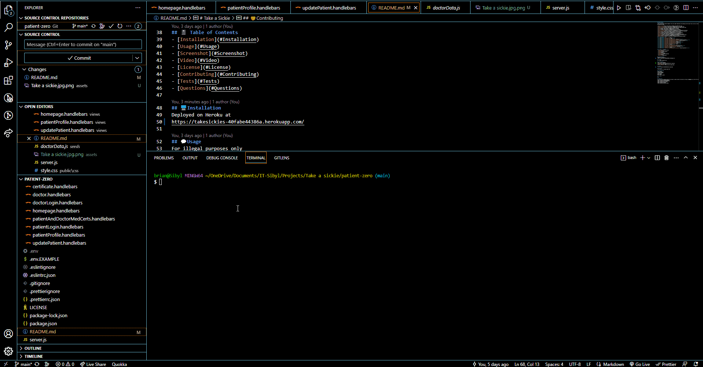

# Take a Sickie

## 📄 Description 

Latest video game release? Hungover from last night? Important work meeting with the boss? Say no more our doctors have a medical certificate for you.
No questions asked. 

## 🪛 Technologies used 

<a href="https://nodejs.org/">Node.js</a>

<a href="https://www.npmjs.com/">NPM</a>

<a href="https://www.npmjs.com/package/express">Express.js</a>

<a href="https://www.npmjs.com/package/express-handlebars">Express Handlebars</a>

<a href="https://www.npmjs.com/package/express-session">express-session</a>

<a href="https://www.npmjs.com/package/mysql2">mysql2</a>

<a href="https://www.npmjs.com/package/sequelize">Sequelize</a>

<a href="https://www.npmjs.com/package/dotenv">dotenv</a>

<a href="https://www.npmjs.com/package/bcrypt">bcrypt</a>

<a href="https://heroku.com/">Heroku</a>

<a href="https://www.npmjs.com/package/eslint">ESLint</a>

<a href="https://www.npmjs.com/package/tailwindcss">Tailwind CSS</a>

<a href="https://www.npmjs.com/package/bootstrap">Bootstrap</a>

<a href="https://nodemon.io/">nodemon</a>

<a href="https://www.npmjs.com/package/generate-password">Password generator</a>

## 📓 Table of Contents

- [Installation](#%EF%B8%8Finstallation)
  
- [Usage](#usage)
  
- [Screenshot](#%EF%B8%8Fscreenshot)
  
- [Video](#video)
  
- [License](#%EF%B8%8Flicense)
  
- [Contributing](#contributing)
  
- [Tests](#%EF%B8%8Ftests)
  
- [Questions](#questions)
    
## 🖥️Installation 

Deployed on Heroku at 
https://takesickies-40fabe44386a.herokuapp.com/
  
## 💬Usage 

For illegal purposes only

## 🖼️Screenshot

Take a sickie homepage

Patient Signup and login 

## 📹Video

Shows a new patient signing up 

## ⚖️License 

This project is licensed under MIT
  
## 🤝Contributing 

Brian Trang,
Jarrod Blanning,
Thorsten Beowulf,
Victor Chan,
Hailin Ruan
With thanks to USYD
  
## 🛠️Tests

N/A
 
## ❔Questions

If you have any questions about this project, please contact me directly at Brian.trang9@gmail.com. Feel free to view more of our projects at 
https://github.com/MakeRedundant
https://github.com/ThorstenBeowulf
https://github.com/jarrodbb
https://github.com/ETBJ
https://github.com/Hailin-Ruan
